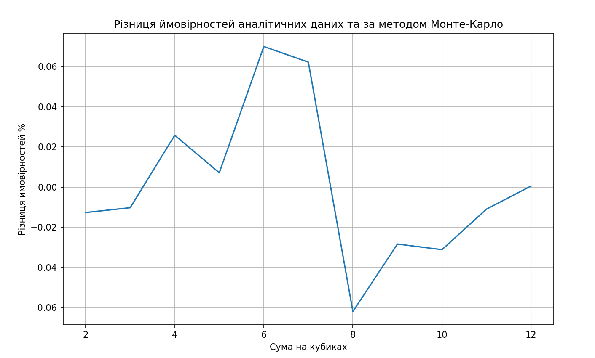

# Використання методу Монте-Карло

   - Виконується 1 000 000 кидків двох кубиків.
   - Підраховується кількість кожної можливої суми (від 2 до 12).
   - Обчислюються ймовірності кожної суми на основі підрахованих даних.

## Результати

### Таблиця результатів

|      Сума      |  Монте-Карло % |  Аналітична %  |
|----------------|----------------|----------------|
│       2        │      2.79      │      2.78      │
│       3        │      5.57      │      5.56      │
│       4        │      8.30      │      8.33      │
│       5        │     11.10      │     11.11      │
│       6        │     13.82      │     13.89      │
│       7        │     16.61      │     16.67      │
│       8        │     13.95      │     13.89      │
│       9        │     11.14      │     11.11      │
│       10       │      8.36      │      8.33      │
│       11       │      5.57      │      5.56      │
│       12       │      2.78      │      2.78      │

### Графік різниці результатів

## Висновки

# Співпадіння результатів:
Результати симуляції методом Монте-Карло дуже близькі до аналітичних значень. Відхилення між ними мінімальні, що вказує на високу точність симуляції.

# Розподіл ймовірностей:
Як видно з таблиці, розподіл ймовірностей для обох методів є практично однаковим. Піки ймовірностей знаходяться на тих самих значеннях сум. Пік у центрі списку обумовлений тим, що для отримання такої суми є більше варіантів при викиданні костей.

# Достовірність моделі:
Дані симуляції методом Монте-Карло підтверджують теоретичні дані, що доводить правильність моделі.

Результати симуляції методом Монте-Карло підтверджують теоретичні дані ймовірностей сум при киданні двох кубиків, що вказує на правильність як самого методу, так і наданих даних.
